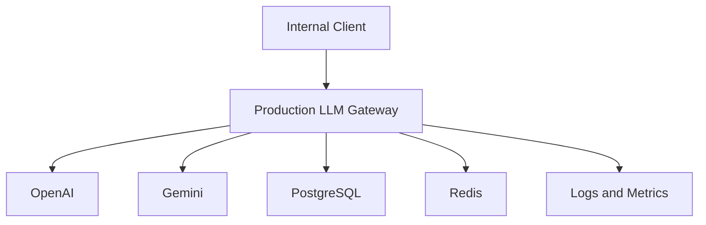
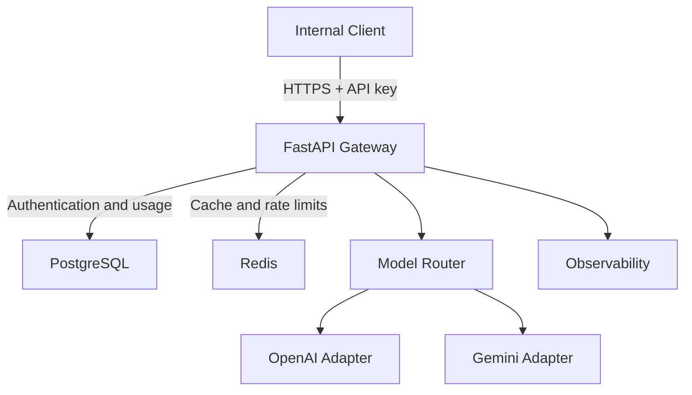
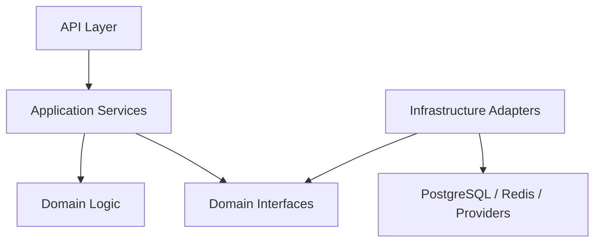
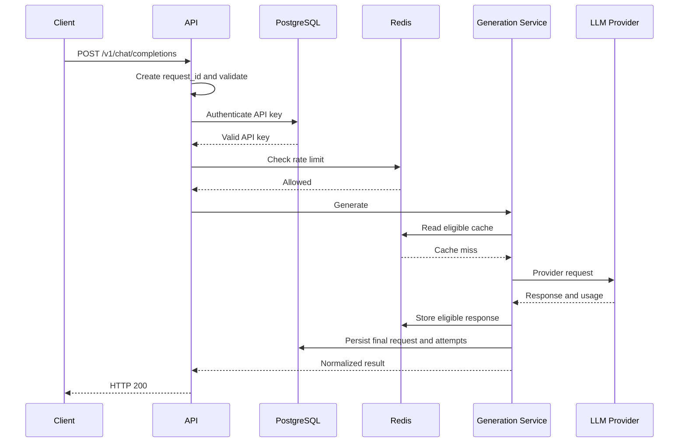
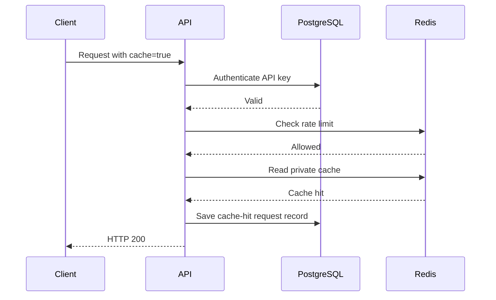
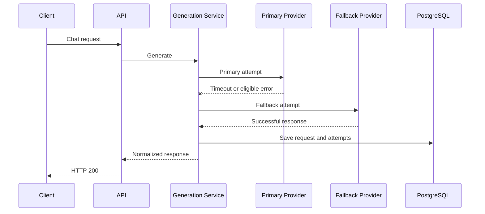

# Production LLM Gateway Architecture

## 1. Document Information

- Status: Proposed
- Related ticket: AI-102
- Last updated: 2026-09-18
- Architecture style: Modular monolith

## 2. Purpose

The Production LLM Gateway provides internal applications with a unified
API for accessing multiple LLM providers.

The gateway centralizes:

- API-key authentication
- Request validation
- Rate limiting
- Response caching
- Model routing
- Provider timeout, retry and fallback
- Usage and estimated-cost tracking
- Logging, metrics and health checks

The MVP supports non-streaming text generation through OpenAI and Gemini.

## 3. Architecture Drivers

The architecture is influenced by the following constraints:

- One developer implements the MVP.
- Development duration is four weeks.
- The system must run locally on Apple Silicon.
- Cloud and provider costs must remain low.
- PostgreSQL is required for authentication and usage data.
- Redis failure must not stop the chat API.
- Provider calls must be mocked in CI.
- The design should remain testable and maintainable.

## 4. Architecture Style

The MVP uses a modular monolith.

The backend is deployed as one FastAPI application, but its source code
is divided into modules with explicit responsibilities and dependency
boundaries.

This provides lower operational complexity while preserving the ability
to extract a module into a separate service if a future operational need
justifies that change.

Microservices are outside the MVP scope.

## 5. System Context



### External actors and systems

| Component | Responsibility |
|---|---|
| Internal client | Sends authenticated chat requests |
| OpenAI | Provides LLM generation |
| Gemini | Provides LLM generation and fallback |
| PostgreSQL | Stores clients, API keys, usage and pricing |
| Redis | Provides caching and distributed rate limiting |
| Logs and metrics | Supports monitoring and incident investigation |

## 6. Container Architecture



## 7. Dependency Classification

| Dependency | Classification | Failure behavior |
|---|---|---|
| FastAPI process | Critical | Service is unavailable |
| PostgreSQL | Critical | Readiness returns HTTP 503 |
| Redis | Non-critical | Service operates in degraded mode |
| OpenAI | Individually non-critical | Gateway may use Gemini |
| Gemini | Individually non-critical | Gateway may use OpenAI |
| All LLM providers | Critical for generation | Chat returns HTTP 503 |
| Metrics exporter | Non-critical | Chat continues; status may be degraded |
| Logging | Operationally important | Chat continues when safely possible |

PostgreSQL is critical because authentication depends on stored API-key
information.

Redis is non-critical because caching can be bypassed and rate limiting
can temporarily use an in-memory fallback.

## 8. Internal Architecture



### 8.1 API layer

Responsibilities:

- Receive HTTP requests
- Create internal request IDs
- Validate request schemas
- Resolve authentication dependencies
- Call application services
- Convert results into HTTP responses
- Convert known exceptions into stable API errors

The API layer must not implement provider retry, routing or cost
calculation directly.

### 8.2 Application services

Application services coordinate use cases.

The main `GenerationService` coordinates:

1. Server-side cache policy
2. Cache lookup
3. Model routing
4. Provider execution
5. Retry and fallback
6. Cache storage
7. Usage persistence
8. Result normalization

### 8.3 Domain logic

Domain logic contains policies that can be tested without external
infrastructure:

- Model-routing policy
- Cache-eligibility policy
- Retry-eligibility policy
- Provider-fallback policy
- Cost calculation
- Error classification

### 8.4 Infrastructure adapters

Infrastructure adapters implement domain interfaces:

- OpenAI provider adapter
- Gemini provider adapter
- PostgreSQL repositories
- Redis cache
- Redis rate limiter
- Metrics exporter
- Structured logger

Application services depend on interfaces, not directly on provider SDKs.

## 9. Dependency Direction

```text
API Layer
    ↓
Application Services
    ↓
Domain Interfaces
    ↑
Infrastructure Implementations
```

Example:

```text
GenerationService
    ↓
LLMProvider interface
    ↑
OpenAIProvider / GeminiProvider
```

This direction allows provider implementations to be replaced by mocks
during unit tests and CI.

## 10. Successful Request Flow



## 11. Cache-Hit Flow



A cache hit still requires authentication and rate limiting.

A cache hit creates a final request record with:

- `source=cache`
- zero provider calls
- zero newly consumed provider tokens
- zero additional provider cost

## 12. Provider Failure and Fallback Flow



Provider policy:

| Failure | Retry | Fallback |
|---|---:|---:|
| Timeout after 10 seconds | No | Immediately |
| HTTP 429 | No | Immediately |
| Fast HTTP 5xx | At most once | Yes |
| Fast network error | At most once | Yes |
| Invalid client request | No | No |
| Unsupported model | No | No |
| Content-policy rejection | No | No |
| Provider authentication failure | No | At most once |

Fallback must not be used to bypass content-safety restrictions.

## 13. Total Request Deadline

Configuration:

```text
Provider-attempt timeout: 10 seconds
Maximum primary retries: 1
Total request deadline: 25 seconds
Backoff base: 0.5 seconds
```

Retry is conditional on:

- Error category
- Time remaining
- Provider policy
- Total request deadline

A timeout uses most of an attempt budget, so the gateway moves directly
to fallback instead of retrying the same provider.

## 14. Redis Degradation

### Rate-limiter failure

```text
Redis rate-limit failure
→ record warning and metric
→ use in-memory rate limiter
→ continue request
```

### Cache-read failure

```text
Redis cache-read failure
→ treat as cache miss
→ do not repeatedly retry Redis
→ call provider
→ continue request
```

Redis failure produces readiness status `degraded` with HTTP 200.

## 15. Usage Persistence Failure

If generation succeeds but usage persistence fails:

1. The gateway records a structured error when possible.
2. The gateway increments a persistence-failure metric.
3. The generated response is still returned to the client.
4. The API does not expose the persistence failure to the client.

This avoids client retries that could create duplicate provider cost.

## 16. Client Disconnection

When the client disconnects during generation, the gateway performs
best-effort cancellation of the provider request.

Cancellation does not guarantee zero provider cost because the provider
may already have accepted and processed the request.

The gateway records a client-disconnection event when detection is
possible.

## 17. Request Persistence Strategy

The MVP stores only final request records.

It does not create a `pending` database record before calling a provider.

Benefits:

- Fewer database operations
- Lower implementation complexity
- Simpler request flow

Trade-off:

- A process crash during generation may cause the request record to be
  lost.

Pending/final state transitions and durable event processing are deferred
to the roadmap.

## 18. Proposed Source-Code Structure

```text
app/
├── api/
│   ├── dependencies/
│   ├── middleware/
│   └── routes/
├── core/
│   ├── config.py
│   ├── exceptions.py
│   └── security.py
├── domain/
│   ├── interfaces/
│   ├── models/
│   └── policies/
├── services/
│   ├── generation_service.py
│   ├── routing_service.py
│   └── usage_service.py
├── providers/
│   ├── openai_provider.py
│   └── gemini_provider.py
├── repositories/
│   ├── api_key_repository.py
│   └── usage_repository.py
├── db/
│   ├── models/
│   └── session.py
├── cache/
├── observability/
└── main.py
```

This is a proposed structure rather than a requirement to create an
empty directory for every concept.

## 19. Gateway Boundaries

The gateway owns:

- Authentication
- Request validation
- Rate limiting
- Caching
- Model routing
- Provider reliability
- Usage tracking
- Cost estimation
- Operational telemetry

The gateway does not own:

- Chatbot user interface
- RAG
- Agent workflows
- Model training
- Official billing
- Complete conversation storage
- Guarantees that generated content is factually correct

## 20. Known Limitations

- Non-streaming responses only
- One application deployment unit
- One API instance in the initial staging environment
- No idempotency-key support
- No background worker
- No durable request-event processing
- Metrics failure may reduce observability without stopping chat traffic