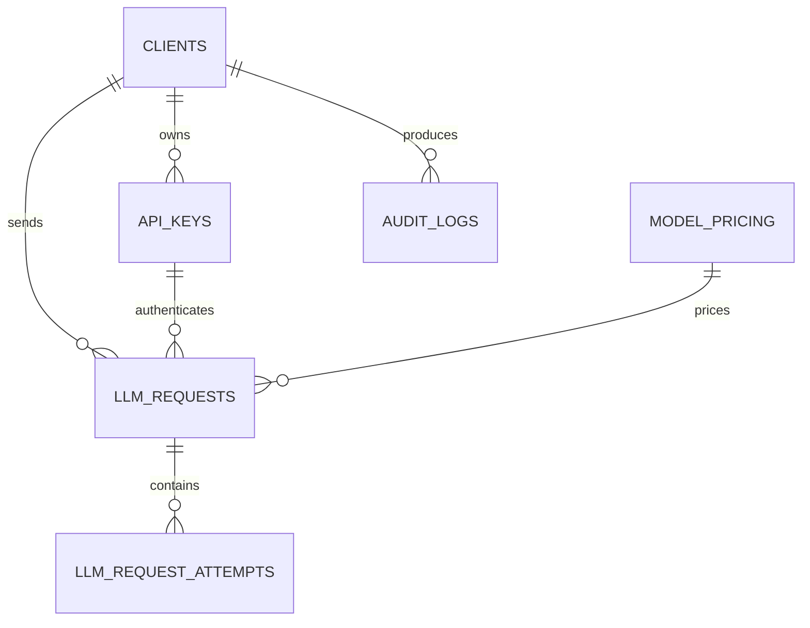

# Production LLM Gateway Database Design

## 1. Document Information

- Status: Proposed
- Related ticket: AI-104
- Database: PostgreSQL
- Migration tool: Alembic
- Last updated: 2026-09-18

## 2. Design Goals

The database supports:

- Client management
- API-key authentication and revocation
- LLM request accounting
- Provider-attempt analysis
- Model-pricing history
- Administrative auditing
- Usage reporting
- Ninety-day usage retention

The database must not store:

- Raw API keys
- Provider credentials
- Complete prompts by default
- Complete model responses by default
- Internal stack traces

## 3. Entity-Relationship Diagram



## 4. General Conventions

- Primary keys use UUID.
- Timestamps use `TIMESTAMPTZ`.
- Application timestamps are stored in UTC.
- Monetary values use `NUMERIC`.
- Status columns use `VARCHAR + CHECK`.
- Schema changes are managed through Alembic.
- Production tables are not created automatically during API startup.

## 5. Table: clients

Represents an application or workload that uses the gateway.

| Column | Type | Null | Description |
|---|---|---:|---|
| `id` | UUID | No | Primary key |
| `name` | VARCHAR(150) | No | Unique client name |
| `status` | VARCHAR(20) | No | `active` or `disabled` |
| `created_at` | TIMESTAMPTZ | No | Creation time |
| `updated_at` | TIMESTAMPTZ | No | Last update |

Constraints:

```text
PRIMARY KEY (id)
UNIQUE (name)
CHECK status IN ('active', 'disabled')
```

A disabled client cannot authenticate with any of its API keys.

## 6. Table: api_keys

Stores API-key identity and revocation information.

| Column | Type | Null | Description |
|---|---|---:|---|
| `id` | UUID | No | Primary key |
| `client_id` | UUID | No | Owner client |
| `name` | VARCHAR(100) | No | Administrative label |
| `key_prefix` | VARCHAR(32) | No | Safe display prefix |
| `key_digest` | VARCHAR(64) | No | HMAC-SHA256 digest |
| `digest_version` | SMALLINT | No | HMAC secret version |
| `status` | VARCHAR(20) | No | `active` or `revoked` |
| `expires_at` | TIMESTAMPTZ | Yes | Optional expiry |
| `last_used_at` | TIMESTAMPTZ | Yes | Last successful authentication |
| `created_at` | TIMESTAMPTZ | No | Creation time |
| `revoked_at` | TIMESTAMPTZ | Yes | Revocation time |

Constraints:

```text
PRIMARY KEY (id)
FOREIGN KEY (client_id) REFERENCES clients(id) ON DELETE RESTRICT
UNIQUE (key_digest)
CHECK status IN ('active', 'revoked')
CHECK digest_version > 0
```

Indexes:

```text
UNIQUE INDEX ON api_keys(key_digest)
INDEX ON api_keys(client_id, status)
INDEX ON api_keys(key_prefix)
```

The raw API key is displayed once by the CLI and is never stored.

## 7. API-Key Verification

Verification flow:

```text
Raw API key
→ determine supported digest version
→ calculate HMAC-SHA256
→ query key_digest
→ check key status
→ check expiry
→ check client status
```

Password hashing such as bcrypt is not used because generated API keys
have high entropy and are checked on every request.

HMAC secret rotation must support at least the current digest version and
a controlled migration path for previous versions.

## 8. Table: llm_requests

Stores the final summary of an authenticated gateway request.

| Column | Type | Null | Description |
|---|---|---:|---|
| `id` | UUID | No | Internal primary key |
| `request_id` | VARCHAR(40) | No | Public gateway request ID |
| `client_request_id` | VARCHAR(100) | Yes | Client correlation value |
| `client_id` | UUID | No | Request owner |
| `api_key_id` | UUID | No | Authenticating key |
| `status` | VARCHAR(20) | No | Final request status |
| `source` | VARCHAR(20) | No | `provider` or `cache` |
| `requested_model` | VARCHAR(150) | No | Client model or `auto` |
| `actual_model` | VARCHAR(150) | Yes | Selected model |
| `provider` | VARCHAR(50) | Yes | Final provider |
| `input_tokens` | INTEGER | No | Newly used input tokens |
| `output_tokens` | INTEGER | No | Newly used output tokens |
| `estimated_cost` | NUMERIC(18,12) | Yes | Estimated USD cost |
| `currency` | CHAR(3) | No | Default `USD` |
| `pricing_id` | UUID | Yes | Pricing version |
| `latency_ms` | INTEGER | No | Total request latency |
| `provider_latency_ms` | INTEGER | Yes | Final provider latency |
| `retry_count` | SMALLINT | No | Number of retries |
| `fallback_used` | BOOLEAN | No | Whether fallback succeeded |
| `cache_requested` | BOOLEAN | No | Client requested cache |
| `cache_eligible` | BOOLEAN | No | Server allowed cache |
| `cache_hit` | BOOLEAN | No | Response came from cache |
| `error_code` | VARCHAR(80) | Yes | Normalized final error |
| `finish_reason` | VARCHAR(50) | Yes | Provider finish reason |
| `created_at` | TIMESTAMPTZ | No | Completion timestamp |

Constraints:

```text
PRIMARY KEY (id)
UNIQUE (request_id)

FOREIGN KEY (client_id)
    REFERENCES clients(id)
    ON DELETE RESTRICT

FOREIGN KEY (api_key_id)
    REFERENCES api_keys(id)
    ON DELETE RESTRICT

FOREIGN KEY (pricing_id)
    REFERENCES model_pricing(id)
    ON DELETE RESTRICT

CHECK status IN ('succeeded', 'failed', 'rejected')
CHECK source IN ('provider', 'cache')
CHECK input_tokens >= 0
CHECK output_tokens >= 0
CHECK latency_ms >= 0
CHECK retry_count >= 0
CHECK currency = 'USD'
```

Indexes:

```text
UNIQUE INDEX ON llm_requests(request_id)
INDEX ON llm_requests(client_id, created_at DESC)
INDEX ON llm_requests(api_key_id, created_at DESC)
INDEX ON llm_requests(provider, created_at DESC)
INDEX ON llm_requests(status, created_at DESC)
INDEX ON llm_requests(created_at)
```

The standalone `created_at` index supports retention cleanup.

## 9. Table: llm_request_attempts

Stores one row for each provider call performed during a request.

| Column | Type | Null | Description |
|---|---|---:|---|
| `id` | UUID | No | Primary key |
| `llm_request_id` | UUID | No | Parent request |
| `attempt_number` | SMALLINT | No | Starts at one |
| `provider` | VARCHAR(50) | No | Called provider |
| `model` | VARCHAR(150) | No | Called model |
| `status` | VARCHAR(30) | No | Attempt outcome |
| `error_category` | VARCHAR(50) | Yes | Normalized failure category |
| `http_status` | SMALLINT | Yes | Provider HTTP status |
| `latency_ms` | INTEGER | No | Attempt latency |
| `input_tokens` | INTEGER | Yes | Usage when available |
| `output_tokens` | INTEGER | Yes | Usage when available |
| `created_at` | TIMESTAMPTZ | No | Attempt timestamp |

Constraints:

```text
PRIMARY KEY (id)

FOREIGN KEY (llm_request_id)
    REFERENCES llm_requests(id)
    ON DELETE CASCADE

UNIQUE (llm_request_id, attempt_number)

CHECK attempt_number > 0
CHECK status IN ('succeeded', 'timeout', 'failed', 'cancelled')
CHECK latency_ms >= 0
CHECK input_tokens IS NULL OR input_tokens >= 0
CHECK output_tokens IS NULL OR output_tokens >= 0
```

Indexes:

```text
INDEX ON llm_request_attempts(llm_request_id)
INDEX ON llm_request_attempts(provider, created_at DESC)
INDEX ON llm_request_attempts(status, created_at DESC)
```

Provider error messages are normalized before persistence. Raw SDK
exceptions are not stored.

## 10. Table: model_pricing

Stores versioned model prices.

| Column | Type | Null | Description |
|---|---|---:|---|
| `id` | UUID | No | Primary key |
| `provider` | VARCHAR(50) | No | Provider name |
| `model` | VARCHAR(150) | No | Model name |
| `input_price_per_million` | NUMERIC(18,8) | No | Input price |
| `output_price_per_million` | NUMERIC(18,8) | No | Output price |
| `currency` | CHAR(3) | No | Default `USD` |
| `effective_from` | TIMESTAMPTZ | No | Start of price version |
| `effective_to` | TIMESTAMPTZ | Yes | End of price version |
| `created_at` | TIMESTAMPTZ | No | Creation time |

Constraints:

```text
PRIMARY KEY (id)
UNIQUE (provider, model, effective_from)

CHECK input_price_per_million >= 0
CHECK output_price_per_million >= 0
CHECK currency = 'USD'
CHECK effective_to IS NULL OR effective_to > effective_from
```

Indexes:

```text
INDEX ON model_pricing(provider, model, effective_from DESC)
```

A price change creates a new row. Historical pricing rows are not
updated or deleted while referenced by requests.

The application must prevent overlapping effective periods for the same
provider and model.

## 11. Table: audit_logs

Stores administrative actions.

| Column | Type | Null | Description |
|---|---|---:|---|
| `id` | UUID | No | Primary key |
| `client_id` | UUID | Yes | Related client |
| `action` | VARCHAR(80) | No | Administrative action |
| `resource_type` | VARCHAR(50) | No | Resource category |
| `resource_id` | UUID | Yes | Affected resource |
| `actor` | VARCHAR(100) | No | CLI or admin identity |
| `metadata` | JSONB | No | Non-sensitive context |
| `created_at` | TIMESTAMPTZ | No | Event time |

Example actions:

```text
client.created
client.disabled
api_key.created
api_key.revoked
pricing.created
```

Audit metadata must not contain raw API keys or provider credentials.

Indexes:

```text
INDEX ON audit_logs(client_id, created_at DESC)
INDEX ON audit_logs(action, created_at DESC)
INDEX ON audit_logs(resource_type, resource_id)
```

## 12. Final Persistence Transaction

After generation finishes, the gateway saves the request summary and all
provider attempts in one database transaction:

```text
BEGIN
    INSERT llm_requests
    INSERT llm_request_attempt 1
    INSERT llm_request_attempt 2
COMMIT
```

If any insert fails:

```text
ROLLBACK
→ record persistence error through logs and metrics
→ return an already-generated result to the client
```

This avoids partial request history.

## 13. Request Recording Limitations

The MVP writes only final request records.

A process crash before final persistence may lose request and attempt
data.

Pending states, transactional outbox and durable event processing are
deferred to the roadmap.

Unauthenticated requests are primarily measured through logs and metrics
because they cannot be reliably linked to a valid client or API key.

## 14. Revocation and Deletion

API keys are revoked instead of hard-deleted:

```text
status = revoked
revoked_at = current timestamp
```

Clients are disabled instead of immediately deleted:

```text
status = disabled
```

This preserves:

- Usage history
- Audit trails
- Foreign-key relationships
- Incident investigation data

## 15. Retention

The usage-retention target is 90 days.

The MVP provides a manual cleanup command.

Deleting an old `llm_requests` row cascades to its
`llm_request_attempts`.

Automatic scheduled cleanup is outside the MVP scope.

The cleanup operation must not delete:

- Clients
- API keys
- Audit history required by policy
- Pricing rows still referenced by requests

## 16. Sensitive Data Policy

The following values must never be persisted:

- Raw client API keys
- Provider API keys
- Database credentials
- Complete prompts by default
- Complete LLM responses by default
- Raw provider stack traces
- Authorization headers

Operational logs and JSONB metadata follow the same policy.

## 17. Migration Strategy

All schema changes use Alembic:

```text
Create or update SQLAlchemy models
→ generate migration
→ review generated SQL
→ apply migration locally
→ test upgrade
→ test downgrade where safe
→ commit migration
```

The application must not use `create_all()` as a replacement for
production migrations.